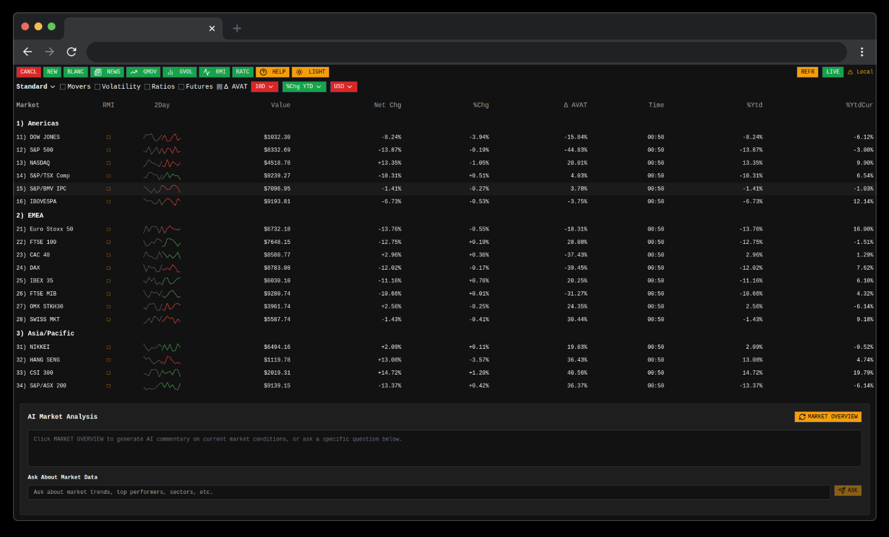

# Bloomberg Terminal Clone

Clone of the Bloomberg Terminal built with Next.js 15, React 19, and TypeScript. This project demonstrates real-time financial data visualization with a professional interface inspired by the Bloomberg Terminal. Structured as an SPA because for a terminal with constantly mutating financial data, URL structure and browser history have limited utility compared to a traditional SPA approach.



## Features

- **Real-time Market Data**: Simulated market updates with configurable refresh rates
- **Multiple Views**: Market data, news, market movers, and volatility analysis
- **Interactive UI**: Terminal-like interface with keyboard shortcuts
- **Watchlist**: Create and manage lists of financial instruments
- **Dark/Light Mode**: Toggle between color schemes
- **Responsive Design**: Works on desktop and tablet devices

## Tech Stack

- **Framework**: Next.js 15 (App Router)
- **UI Library**: React 19 with shadcn/ui components
- **Styling**: Tailwind CSS
- **State Management**: Jotai for local state, React Query for server state
- **Data Storage**: Upstash Redis
- **Animation**: Motion (formerly Framer Motion)
- **Linting/Formatting**: Biome.js

## Getting Started

### Prerequisites

- Node LTS
- pnpm

### Environment Variables

Create a `.env.local` file with the following variables:

```
# Upstash Redis connection details
UPSTASH_REDIS_REST_URL=your_upstash_redis_url
UPSTASH_REDIS_REST_TOKEN=your_upstash_redis_token

# Alpha Vantage API key for market data
ALPHA_VANTAGE_API_KEY=your_alpha_vantage_api_key

# OpenAI API key for AI features
OPENAI_API_KEY=your_openai_api_key

# Allowed origins for API access (comma-separated list, no spaces)
ALLOWED_ORIGINS=https://your-domain.com,http://localhost:3000
```

## Project Structure

The project is structured as follows:

- `/app`: Next.js App Router pages and API routes
- `/components/bloomberg`: Terminal-specific components
  - `/api`: API client functions for market data fetching and simulation
  - `/atoms`: Jotai atoms for local state management
  - `/core`: Core Bloomberg Terminal components
    - Reusable UI elements specific to the terminal (buttons, modals, etc.)
    - User interaction components (keyboard shortcuts, watchlist, etc.)
  - `/hooks`: Custom React hooks for data fetching and UI state
  - `/layout`: Layout components that define the terminal structure
    - Terminal container, header, footer, and navigation elements
  - `/lib`: Terminal-specific utility functions and configuration
  - `/providers`: Context providers for React Query and other global state
  - `/ui`: Terminal-specific UI components
    - Data visualization components (tables, sparklines, etc.)
    - Terminal-specific UI elements that aren't part of the core
  - `/views`: Main view components for different terminal screens
    - Market view, news view, volatility view, etc.
- `/components/ui`: shadcn/ui base components (design system)
- `/lib`: Application-wide utility functions and shared code
- `/public`: Static assets and images

### Component Organization Philosophy

Components are organized based on:

- **Core Components**: Foundational UI elements specific to the Bloomberg Terminal interface
- **Layout Components**: Define the overall structure and layout of the application
- **UI Components**: Specialized components for data visualization and user interaction
- **View Components**: Complete screens or major sections of the application

## Performance Optimizations

- React Query for efficient data fetching and caching
- Optimized update cycles to reduce API calls
- Memoization of expensive calculations
- Conditional rendering for performance-critical components

## Security Features

- **Origin Restriction**: API endpoints are restricted to specific domains configured via the `ALLOWED_ORIGINS` environment variable
- **Rate Limiting**: Prevents abuse by limiting requests per IP address
- **Input Validation**: All API inputs are validated and sanitized using Zod schemas
- **Response Limiting**: AI responses are limited in token count to prevent excessive usage
- **Environment Variables**: Sensitive keys are stored in environment variables and not exposed to the client

## License

MIT
